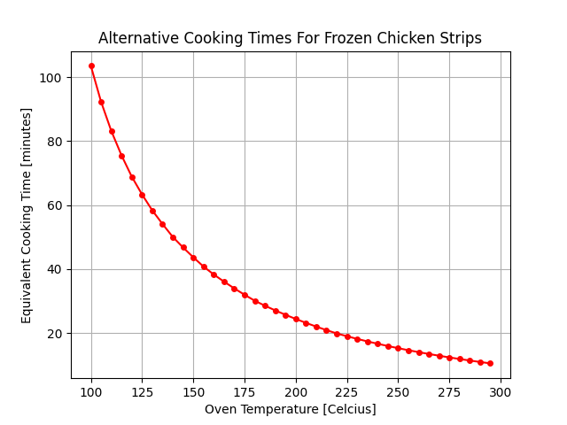

# Alternative Cooking Times

This script calculates alternative cooking times for people who want to use their oven at temperatures other than the recommended value in recipes: warmer to cook your food quickly or colder to get a more evenly distributed cook. The following assumptions are made: all heat transfer is through radiation (note: the answers will not be accurate for convection ovens), that the change in blackbody coefficient for the oven between the two cooking temperatures is negligible, and that total heat transferred into the food is a valid comparative metric to determine the progress of cooking.

The package uses the Euler Method to step through the radiative heat transfer PDE and approximate the solution. The script also produces a graph of the approximate cooking times for all oven temperatures for the given instructions on the package.

### Usage Example

Let's examine the simple case of heating frozen chicken strips in the oven. The package I have suggests that at 215°C (425°F) they will take 20 minutes to cook from frozen (-15°C or 5°F). Knowing that the safe cooking temperature of chicken is 75°C (165°F) we will use that as an approximation of the normal final chicken temperature. 

If, for example, my oven takes forever to heat up and I decide to cook them at 150°C (300°F), how long should they take in the oven?

Running the script and inputting the values as prompted, the program will return 45 minutes and then display a plot of the cooking time for all realistic temperatures.

### Walking through the algorithm 

Heat transfer through radiation is governed by [the following equation](https://www.sciencedirect.com/topics/engineering/radiation-heat-transfer):

Unfortunately, the differential equation doesn't have a particularly clean solution. We can numerically solve for values of interest. An example of this is the [Euler Method](https://en.wikipedia.org/wiki/Euler_method) which approximates the path of the solution by stepping through and constantly re-evaluating first-order derivatives to evaluate small changes.

Looking at the first couple steps then grouping constants and re-arranging: 

From experience, c1 will tend to be on the order of 10^-10, so rather than solving a 5th degree polynomial, we can eliminate higher powers of c1 terms and simplify the approximation. Even better, if we continue along this stepping process and eliminating higher order c1 terms, we find a simple c1 expression for an arbitrary number of steps and a c1 value that decreases (and therefore improves the validity of the approximation) with an increasing number of steps.

Now we can use this c1 value and plug in values for the new temperature settings and step through using Euler's Method until we reach the final temperature.

### Author
* Teddy Rowan

